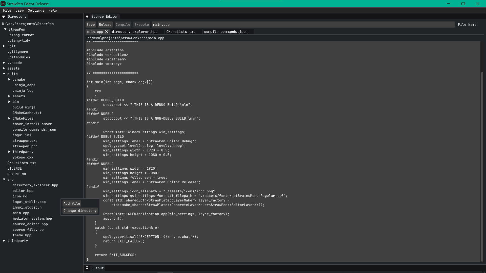

# StrawPen
Basic Text Editor

## Features
- Create/read/write/save/rename/delete ASCII files
- Directory Explorer for working efficiently within a directory
- Multiple Tabs to work with multiple text files simulatenously

## Dependencies
- StrawPlate Library

## Building
### Cmake
- Run cmake in root directory.