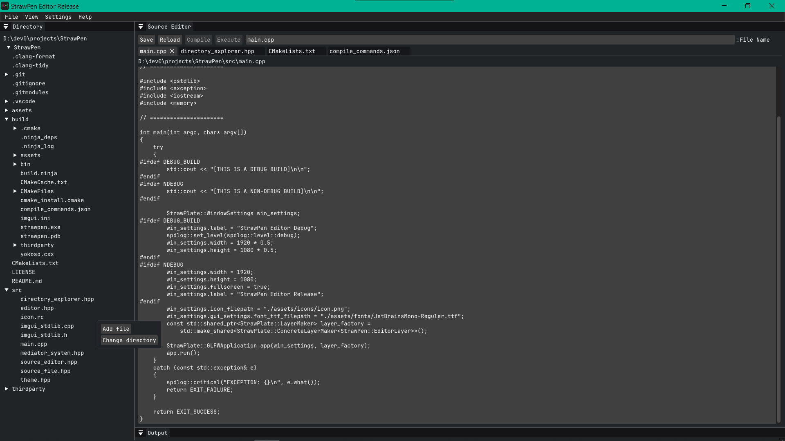
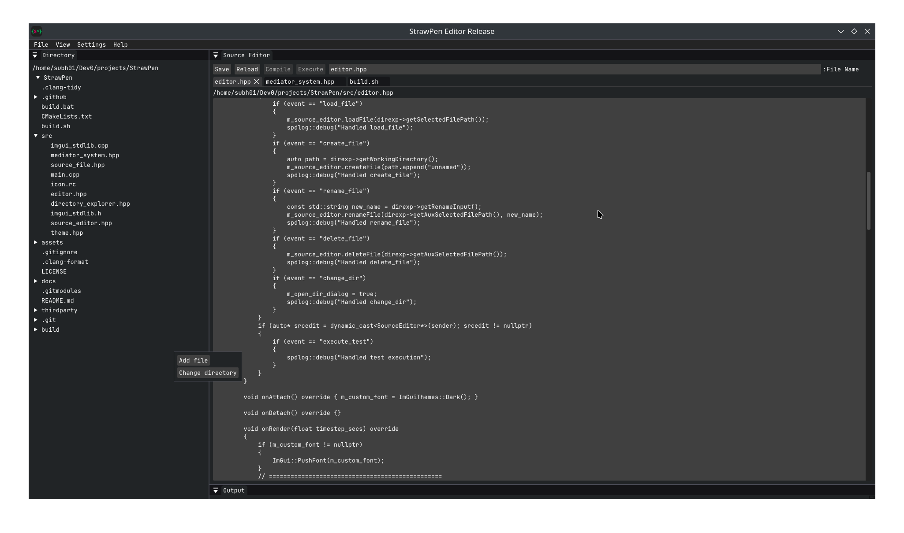

# StrawPen
Basic Text Editor.


Windows-10


Linux-KDE

### What it is
<hr>
- StrawPen is a basic text editor running on ImGui/GLFW/OpenGL backend.

## Features
- Create/read/write/save/rename/delete ASCII files
- Directory Explorer for working efficiently within a directory
- Multiple Tabs to work with multiple text files simulatenously

## Pre-Requisites:
- Cmake (3.31 or above) : The build system
- C/C++ compiler : (tested on: MSVC/gcc/clang)

## Dependencies
- StrawPlate library: https://github.com/LightShade12/StrawPlate

## Building
### System: Cmake ( v3.27 <= v3.31.6 <= )
### Build supports: Windows, Linux
### Pre-Requisites:
- StrawPlate library git submodule (clone this repo with ```--recursive```)
- Linux : GLFW package from AUR
### One-click build :
#### build.bat (Windows) :
- Run build.bat from repo root
- The executable ```strawpen_rel.exe``` is now in ```build/bin```
#### build.sh (Linux) :
- Run chmod +x build.sh from repo root (adds executable priviledge to the script)
- Run build.sh
- The executable ```strawpen_rel``` is now in ```build/bin```
### CmakeLists.txt
- Run ```cmake -B ./build``` in repo directory(where ```CmakeLists.txt``` resides). 
- Now run ```cd ./build && cmake --build . --config Release```.This will start the compilation and linking with StrawPlate library and build the executable.
- The output executable and runtime assets can now be found in ```build/bin```

## License
StrawPen is licensed under MIT License.
<hr>
<footer>

  2025
</footer>
